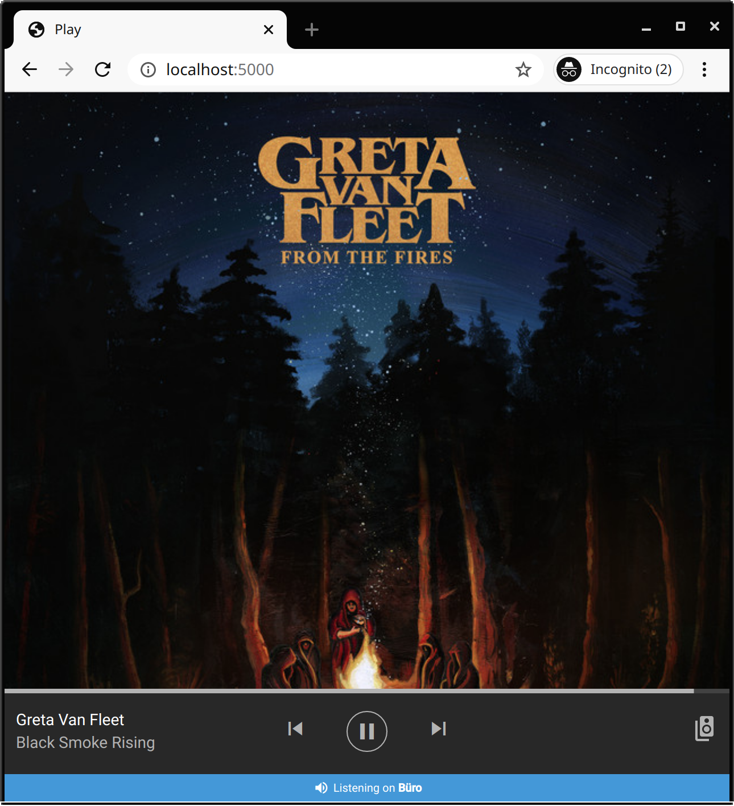

# Play

A simple web based Sonos Controller to select rooms and play/pause music.



## Usage

*Remark*: The docker container must run in the host network otherwise the app is not able to discover Sonos devices.

```
$ docker build -t play .
$ docker run --net=host play
```

